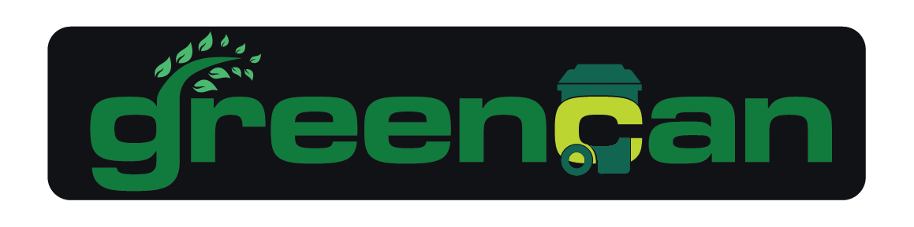

---

Preserving today for Tomorrow’s World

**GreenCan** is an innovative waste management platform designed to promote sustainability and efficient waste disposal.

**Mission**
To revolutionize waste management through innovative recycling solutions that make it easy, rewarding, and impactful for individuals and businesses to participate in environmental stewardship.

**Vision**
A world where waste is not wasted. We envision communities where recycling is second nature, and every discarded item finds new purpose in a circular economy that sustains our planet for generations to come.


## 🚀 Features

✅ **Smart Waste Tracking** – Monitor your waste and recycling habits effortlessly.  
✅ **Eco-Friendly Rewards** – Earn points for responsible waste disposal.  
✅ **Community Engagement** – Connect with local waste management services and eco-enthusiasts.  
✅ **AI-Powered Sorting** – Identify and sort waste with AI image recognition.  
✅ **Educational Hub** – Learn sustainable waste practices through interactive content.  


## 🎯 Why GreenCan?

- 🌍 **Eco-Conscious** – Designed to reduce environmental footprint.  
- 🔍 **Data-Driven** – Leverages AI for optimized waste management.  
- 💡 **Innovative** – Integrates technology to make waste disposal smarter.  
- 🤝 **Community-Oriented** – Empowers individuals to take action together.  

## 🛠️ Tech Stack

- **Frontend:** HTML, CSS, JavaScript (React.js)  
- **Backend:** Node.js  
- **Database:** MongoDB   
- **Design Tools:** Figma, Adobe Illustrator

## 📦 Installation

```bash
#Clone the Repo
git clone https://github.com/your-username/greencan.git

# Navigate to project directory
cd greencan

# Install dependencies
npm install

# Start the development server
npm start
```